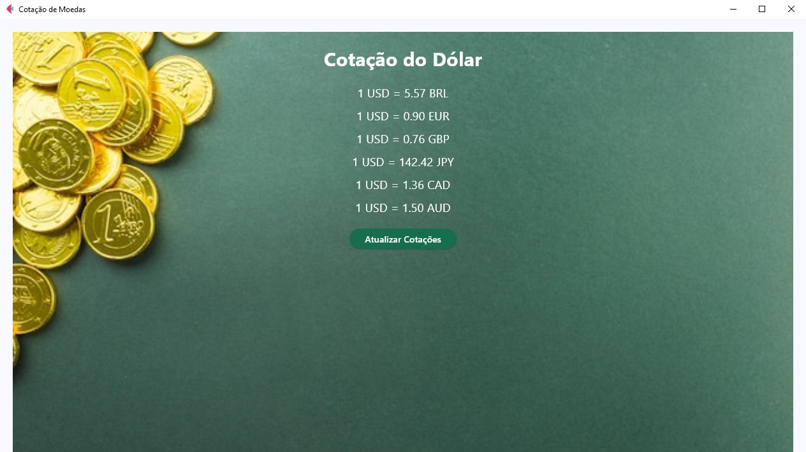

# Cotação de Moedas com Flet

Este projeto é uma aplicação simples para exibir a cotação do dólar em relação a outras moedas fortes, utilizando a biblioteca Flet para a interface gráfica. As cotações são obtidas em tempo real a partir da API ExchangeRate-API, com suporte para moedas como BRL (Real), EUR (Euro), GBP (Libra Esterlina), JPY (Iene), CAD (Dólar Canadense) e AUD (Dólar Australiano).

## Funcionalidades
- **Exibição das taxas de câmbio** do dólar para as moedas selecionadas.
- **Interface moderna e responsiva**, com um fundo visualmente atraente de moedas.
- **Atualização dinâmica** das cotações com um simples clique de botão.

## Tecnologias Utilizadas
- **Python**
- **Flet** para a interface gráfica
- **ExchangeRate-API** para dados de cotação
